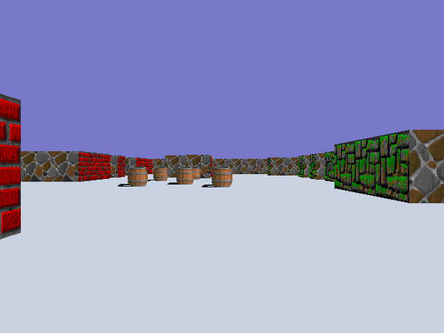

# Cub3D
My first RayCaster with miniLibX

## Instruction
1. ```git clone https://github.com/HaewonSeo/Cub3D.git```
2. ```make```
3.	- ```./cub3D ./cubs/cub.cub``` : start game
	- ```./cub3D ./cubs/cub.cub --save``` : make a screenshot.bmp

## screenshot.bmp


## Reference
+ https://lodev.org/cgtutor/raycasting.html
